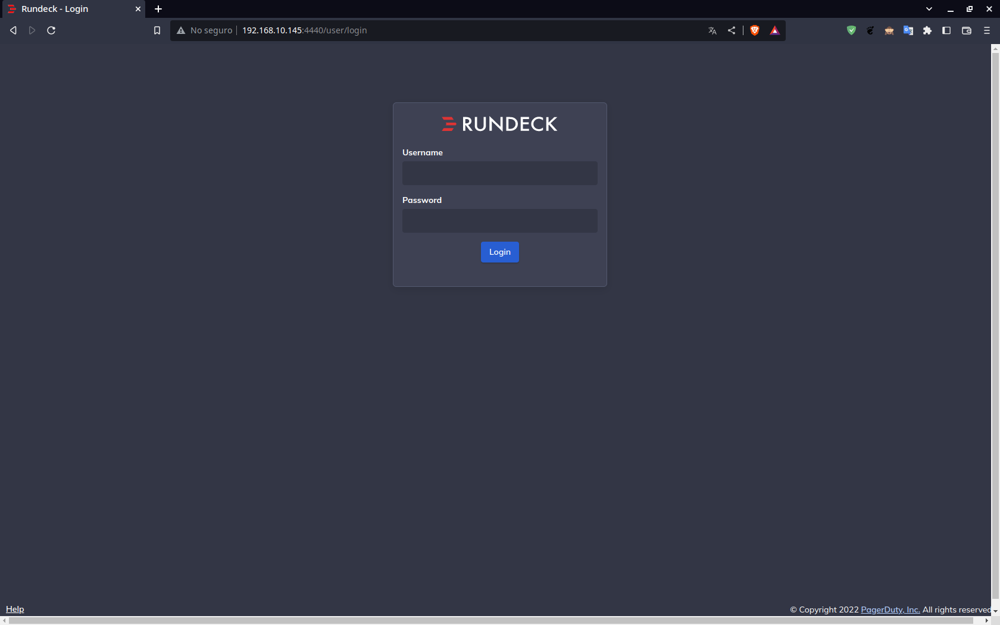

# **Configurar Rundeck**

En la configuración de Rundeck se le asignará la base de datos que hemos [creado con PostgreSQL](/conocimientos_tecnicos/administracion_sistemas/Rundeck/config_rundeck/docs/configPostgres/).

### **Editar propiedades Rundeck**

En la ruta /etc/rundeck/ editaremos el archivo rundeck-config.properties

```
vim /etc/rundeck/rundeck-config.properties
```

Comentaremos la siguiente línea:

```
dataSource.url = jdbc:h2:file:/var/lib/rundeck/data/rundeckdb;DB_CLOSE_ON_EXIT=FALSE;NON_KEYWORDS=MONTH,HOUR,MINUTE,YEAR,SECONDS.
```

=== "rundeck-config.properties"

    ```
    dataSource.dbCreate = none
    #dataSource.url = jdbc:h2:file:/var/lib/rundeck/data/rundeckdb;DB_CLOSE_ON_EXIT=FALSE;NON_KEYWORDS=MONTH,HOUR,MINUTE,YEAR,SECONDS
    grails.plugin.databasemigration.updateOnStart=true
    ```

Procedemos a agregar las siguientes configuraciones para la base de datos, esto debajo de la línea que comentamos:

=== "rundeck-config.properties"

    ```
    dataSource.dbCreate = none
    #dataSource.url = jdbc:h2:file:/var/lib/rundeck/data/rundeckdb;DB_CLOSE_ON_EXIT=FALSE;NON_KEYWORDS=MONTH,HOUR,MINUTE,YEAR,SECONDS
    dataSource.driverClassName = org.postgresql.Driver
    dataSource.url = jdbc:postgresql://localhost:5432/rundeck
    dataSource.username = rundeckuser
    dataSource.password = rundeckpassword
    grails.plugin.databasemigration.updateOnStart=true
    ```

### **Habilitar servidor en la red local**

Suponiendo que estamos utilizando un servidor sin una interfaz gráfica por lo tanto no tendremos manera de acceder con localhost en un navegador.
Lo que se puede realizar es habilitar el servidor en la red con la ip que se tenga. Esto lo hacemos de la siguiente manera:

#### **Ver ip del servidor**

Con el siguiente comando podemos observar las tarjetas de red tiene nuestro servidor. Tomaremos la ip de la tarjeta que estamos ocupando ya que la usaremos en los siguientes pasos

```
ip a
```

#### **Editar propiedades de rundeck**

Editamos el archivo rundeck-config.properties

```
vim /etc/rundeck/rundeck-config.properties
```

Ubicamos la siguiente línea:

=== "rundeck-config.properties"

    ```
        # change hostname here
        grails.serverURL=http://localhost:4440
    ```

Cambiaremos la palabra localhost por la ip de nuestro servidor

=== "rundeck-config.properties"

    ```
        # change hostname here
        grails.serverURL=http://192.168.10.145:4440
    ```

Si usamos vim guardamos y salimos del editor con la combinación de las siguientes teclas, **todo en minúsculas**:

++esc+colon+w+q+exclamation++


#### **Editar propiedades del framework**

Editamos el archivo framework.properties de la siguiente manera

```
vim /etc/rundeck/framework.properties
```
Ubicamos las siguientes lineas dentro del archivo:

=== "framework.properties"

    ```
        # ----------------------------------------------------------------
        # Rundeck server connection information
        # ----------------------------------------------------------------

        framework.server.name = localhost
        framework.server.hostname = localhost
        framework.server.port = 4440
        framework.server.url = http://localhost:4440
    ```

Y reemplazamos la palabra localhost por la ip de nuestro servidor:

=== "framework.properties"

    ```
        # ----------------------------------------------------------------
        # Rundeck server connection information
        # ----------------------------------------------------------------

        framework.server.name = 192.168.10.145
        framework.server.hostname = 192.168.10.145
        framework.server.port = 4440
        framework.server.url = http://192.168.10.145:4440
    ```


#### **Agregar el puerto de Rundeck al firewall**

Agregaremos la regla firewall que permite el puerto TCP Rundeck predeterminado (4440)

```
sudo firewall-cmd --permanent --zone=public --add-port=4440/tcp
```


#### **Agregar el puerto de PostgreSQL al firewall**

Ejecutamos lo sisguientes comandos

```
sudo firewall-cmd --zone=public --add-port=5432/tcp --permanent
sudo firewall-cmd --zone=public --permanent --add-service=postgresql
```


#### **Servicio del firewall**

Reiniciaremos el servicio

```
sudo firewall-cmd --reload
```


#### **Servicio de Rundeck**

Reiniciar el servicio Rundeck para obtener los cambios

```
sudo systemctl restart rundeckd
```

#### **Arrancar servicio Rundeck**

Con esta configuración ya podremos acceder en un navegador con la ip de nuestro servidor al login de rundeck

```
192.168.10.145:4440
```



