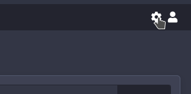
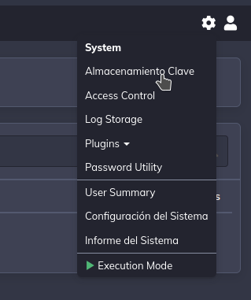
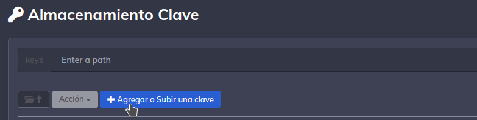
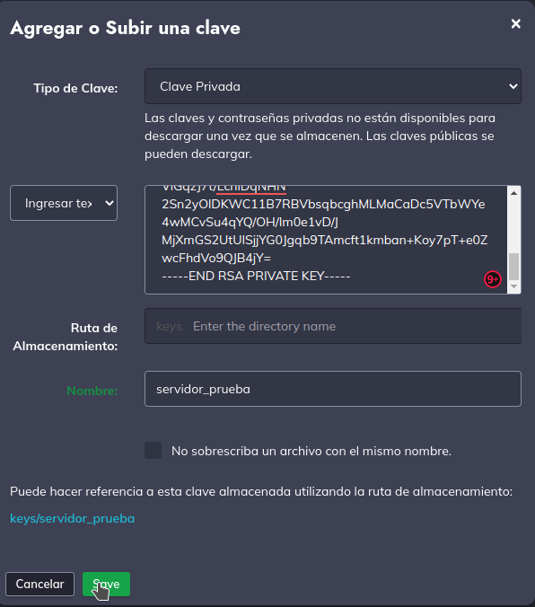

# **Uso y configuración de SSH privada**

### **Almacenar llave privada**

En la interfaz de Rundeck nos dirigimos al menú configuración:

Daremos click al menú Almacenamiento Clave

Procedemos crear una llave privada dandole click al botón Agregar o Subir una clave

Colocaremos las siguientes configuraciones:

1. Tipo de clave: **Clave Privada**.

    !!! info inline end "id_rsa"

        Recordemos que nuestra llave privada
        se encuentra en /var/lib/rundeck/id_rsa

2. Ingresar Texto: Copiaremos todo el contenido de nuestra llave privada **id_rsa**.
3. Ruta de Almacenamiento: Este campo se dejará vacio.
4. Nombre: Se colocará el nombre del archivo a generar, en este caso servidor_prueba.

Guardamos nuestra llave privada.

