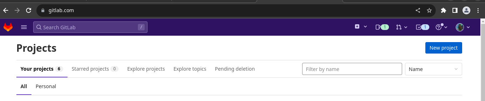
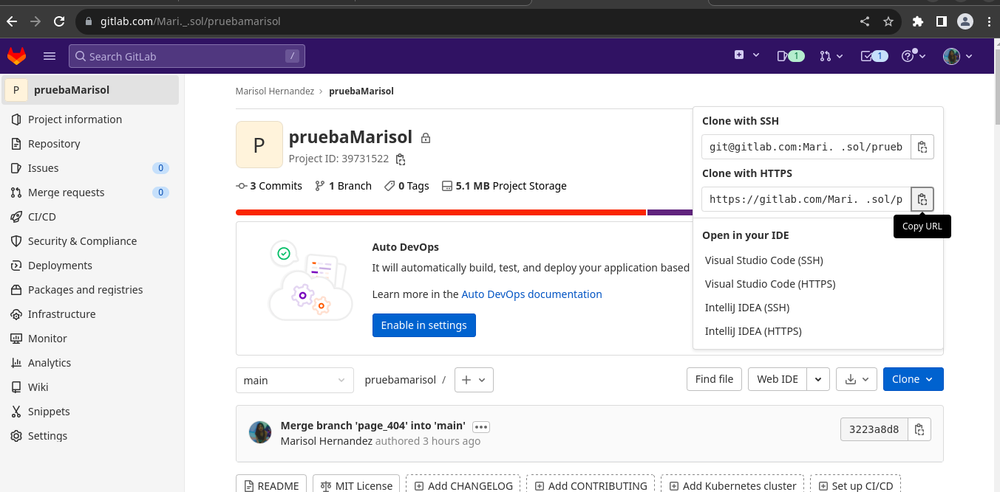
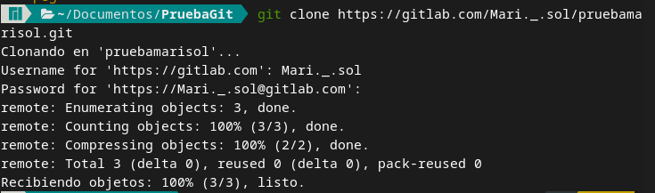

# Instalación de Git localmente 

## **Instalación de Git en Arch Linux**
Antes de instalar la herramienta Git, primero se debe actualizar nuestro sistema de repositorios, para esto abrimos una terminal, colocamos el siguiente comando:
```
sudo pacman -Syu
```
Se utilizará el asistente de instalación Yay, este contiene los paquetes de instalación más actuales y oficiales.
```
sudo pacman -S yay
```

Una vez actualizado nuestro sistema, instalamos Git con el siguiente comando:   
```
yay -S git 

# O con el siguiente comando
sudo pacman -S git
```

Verificar que la instalación se haya realizado correctamente:
```
git --version
``` 

## **Instalación de Git en Debian/Ubuntu**
Desde su terminal, actualice su sistema:
```
sudo apt-get update
sudo apt-get upgrade
```

Después, instale Git con: 
```
sudo apt-get install git
```

## **Instalación de Git en Fedora/CentOS**
Abrir una terminal e instalar Git usando DNF:
```
sudo dnf instalar git
```
Si su distribución todavía usa Yum, instale Git usando:
```
sudo yum instalar git
```
## **Instalación de Git en Windows**
1. Haz clic en este **[enlace](https://git-scm.com/download/win)**, el sitio detectará tu sistema operativo y allí podrás hacer clic en "Download for Windows" e iniciará la descarga inmediatamente.     

2. Una vez descargado, ejecuta el instalador haciendo clic sobre él y sigue las instrucciones que te aparecerán en el programa de instalación, tendrás que hacer clic en "next" (siguiente) varias veces, hasta finalizar el proceso.   

3. Para comprobar que Git se instaló correctamente, ejecuta el tu terminal: 
```
git --version
``` 
*Nota: Deberá aparecer una salida en tu terminal con la versión que fue instalada.*

## **Configuración de Git**

GitLab necesita una configuración muy sencilla de un nombre y un email del usuario.
Esto lo realizamos de la siguiente manera:

El comando para realizar el registro del nombre de usuario es el siguiente, donde la palabra entre comillas **user_name** la reemplazaremos por el nombre de usuario que tenemos en nuestra cuenta de GitLab:
```
git config –global user.name “user_name”
```
Y para la configuración del email lo realizamos con el siguiente comando, donde reemplazaremos la palabra **email_user** por el correo de nuestra cuenta de GitLab
```
git config –global user.name “email_user”
```
## **Crear un repositorio**
Entrar a GitLab y darle clic en el botón azul que dice New project, siguiendo los pasos y llenando los campos que se solicitan, en este caso es pruebaMarisol:


Seleccionar el botón azul llamado Clone, y copiar URL para clonar el proyecto 


En documentos crear una carpeta en donde se va a clonar el proyecto


Abrir la terminal y colocar lo siguiente, la URL es la que se había copiado del repositorio de GitLab.
```
git clone https://gitlab.com/Mari._.sol/pruebamarisol.git
```
Veremos como se empiezan a descargar los archivos del repositorio.


El comando **ls** muestra una lista en orden alfabético de los nombres de todos los archivos en el directorio de trabajo actual.    
El comando **cd “nombre de la carpeta”** se utiliza para acceder a carpetas. 


## **Comandos**
Ver el nombre del repositorio 
```
git remote --v
```

Descargar cambios
```
git fetch origin
```

Mezclar las ramas
```
git merge --ff-only origin/main
```
o   
```
git merge nombre-de-la-rama
```

Cuando creamos, modificamos o eliminamos un archivo, estos cambios suceden en local y no se incluirán en el siguiente commit. Necesitamos usar el comando git add para incluir los cambios del o de los archivos en tu siguiente commit.

Añadir un solo archivo  
```
git add nombre-archivo
```

Añadir todo 
```
git add .
```

Guardar todos los cambio hechos en área de desarrollo. 
```
git commit -m "mensaje de confirmación"
```
*Nota: Después necesitamos escribir un mensaje corto para explicar qué se ha desarrollado o modificado en el código fuente.*

Subir el repositorio a GitLab 
```
git push origin nombre-rama
```

Realizar una copia idéntica de la última versión de un proyecto en un repositorio y la guarda en tu ordenador.
```
git clone https://link-con-nombre-del-repositorio
```
Crear rama
```
git branch nombre-de-la-rama
```

Visualizar ramas 
```
git branch --list
```    
o    
```
git branch
```
     
Borrar una rama 
```
git branch -d nombre-de-la-rama
```

Para cambiarte de una rama a otra.
```
git checkout nombre-de-la-rama
```

Crear y cambiarte a esa rama al mismo tiempo.
```
git checkout -b nombre-de-tu-rama
```

El siguiente comando nos da toda la información necesaria sobre la rama actual.
```
git status
```

Si tu rama ha sido creada recientemente, puede que tengas que cargar y subir tu rama con el siguiente comando:
```
git push --set-upstream nombre-remoto nombre-de-tu-rama 
```
Después
```
git push -u origin nombre-de-tu-rama
```
    
El comando git pull se utiliza para recibir actualizaciones del repositorio remoto.
```
git pull nombre-remoto
```


