# Instalar el tema para MkDocs

Para instalar un tema ocuparemos el siguiente comando:

    pip install nombre_tema

En este caso ocuparemos el tema material, el nombre de instalación para este tema es mkdocs-material por ejemplo: 

    pip install mkdocs-material

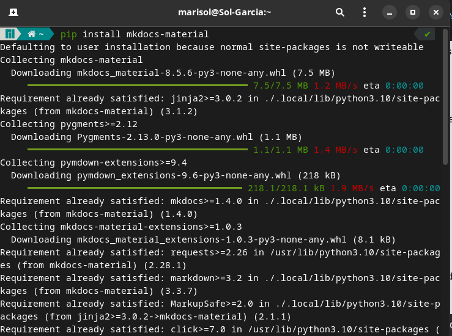

## **Crear un proyecto**

Para crear un proyecto de MkDocs, podemos crear una carpeta en cualquier directorio, en este caso crearé una carpeta llamada sitio_web_mkdocs, en el directorio documentos.

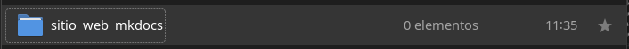


Accedemos a la carpeta que creamos y vamos a crear nuestro proyecto con el siguiente comando:

    mkdocs new mi-proyecto

Donde mi-proyecto se va a remplazar por el nombre del proyecto que vamos a crear, por ejemplo:

    mkdocs new Portal_OpenPyme

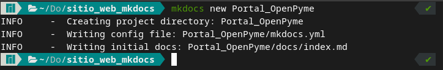

Podemos observar que se creó una carpeta con nuestro proyecto, para continuar con los siguientes pasos debemos acceder a esta carpeta:

    cd Portal_OpenPyme

    

Dentro de nuestro proyecto ejecutaremos un comando para iniciar el servidor de MkDocs:

    mkdocs serve

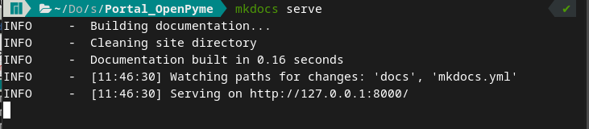

Podemos observar que nuestro servidor inicio correctamente, para acceder a la interfaz de MkDocs lo podemos hacer de dos maneras, en nuestro navegador colocamos la siguiente dirección:

    127.0.0.1:8000

O podemos ocupar la siguiente manera:

    localhost:8000

Al acceder a la interfaz podemos observar la siguiente pantalla de ejemplo:
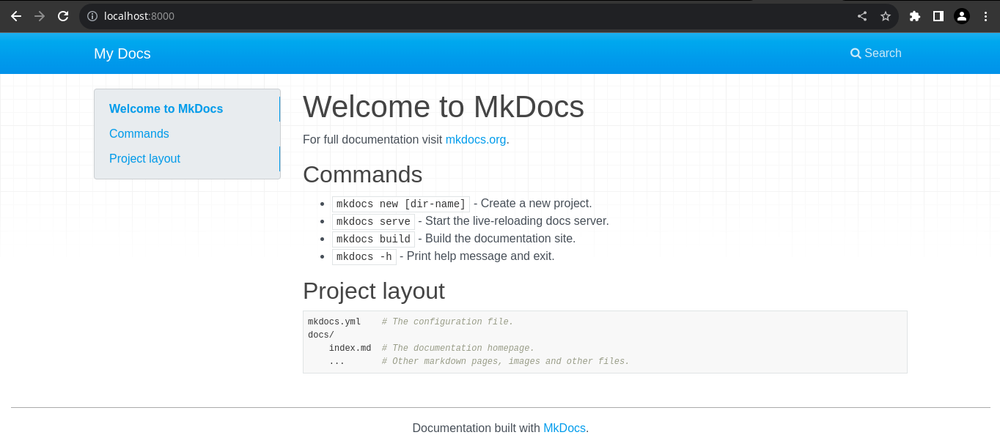

## **Configurar un proyecto en MkDocs**

Para configurar un proyecto podemos observar dentro de la carpeta de nuestro proyecto un archivo llamado **mkdocs.yml**, en este vamos a poder realizar la personalización del proyecto.

Al abrir este archivo observaremos que tiene un atributo llamado **site_name**, en este va el nombre de nuestro proyecto, el cual remplazaremos por Portal OpenPyme.

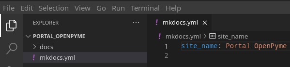

Para cambiar el tema de la interfaz se realiza  en el archivo mkdocs.yml, abajo del site_name   escribiremos el nombre del tema que instalamos desde el inicio, por ejemplo:

    theme: material

*Nota: Existen diferentes nombres de temas, para este ejemplo se utilizará el tema mencionado anteriormente.*

Una vez guardando los cambios y actualizando la página, la interfaz cambiaría el color y la forma de la barra de navegación.

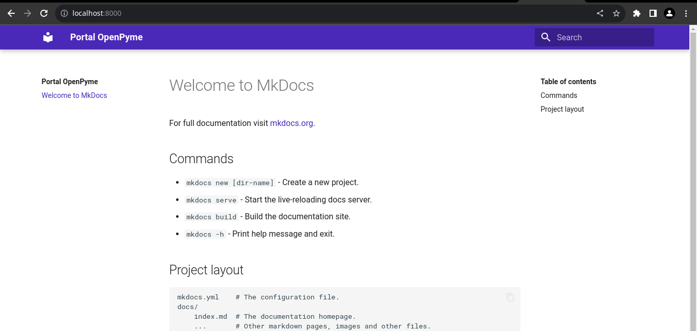

## **Crear una nueva página**

Para crear una nueva página y al mismo tiempo hacer que se muestre en la lista de navegación, se debe ingresar al directorio en donde se creó el proyecto, por ejemplo:

    documentos/sitio_web_mkdocs/Portal_OpenPyme/docs


Dentro de la carpeta docs se pueden crear archivos **.md** los cuales se utilizarán para generar una nueva página en el proyecto, el archivo **index.md** es el que se crea por defecto cuando creamos el proyecto, para este ejemplo se creó un archivo llamados **java.md**.

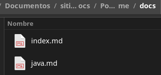

Esto se realiza en el archivo mkdocs.yml, en donde se utiliza la función nav, esta función se utiliza para nuevos enlaces de navegación ya sea dentro de la misma página o en otra diferente.
```
nav:
```
Abajo de la función nav se deja un espacio usando la tecla de tabulador, se escribe un guion seguido del nombre de la etiqueta que vamos a crear, después se escribe el nombre del archivo que creamos, es el que nos abrirá una nueva interfaz, por ejemplo:
```
- Java: java.md
```
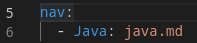

Al entrar nuevamente a la interfaz, se pueden observar los cambios y configuraciones que se han realizado:
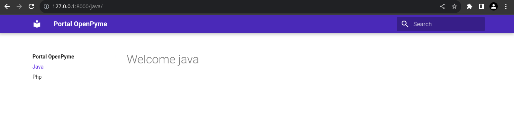

## **Terminar el servidor**
Nos ubicamos en la terminal en donde ejecutamos el comando **mkdocs serve**, y presionamos  las teclas **control + c**.
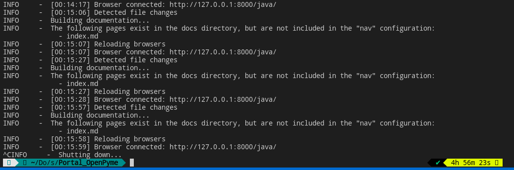
