# Agregar párrafos

Una forma de agregar texto en párrafos es escribiendo el texto y para separarlo en párrafos es dejando una línea en blanco entre una o más líneas de texto, por ejemplo:
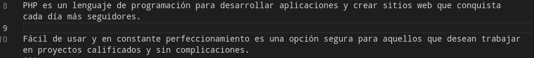

Otra forma  es agregando las etiquetas **< p >** y **< /p >** al principio y al final de cada uno de los bloques de texto.
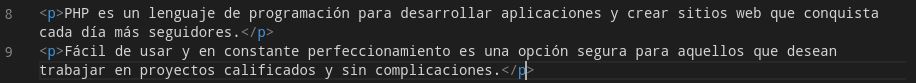

## **Agregar encabezados**

Si queremos agregar un encabezado o un título, se puede realizar colocando el símbolo de numeral seguido del título que queremos mostrar, también se pueden colocar por tamaños, por ejemplo:

*# Welcome java*

*## Welcome java*

*### Welcome java*

*#### Welcome java*   

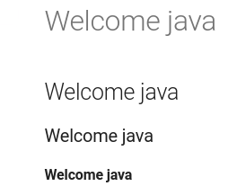

## **Salto de línea** 

Para agregar un salto de línea entre un párrafo y otro se puede realizar de dos maneras, una es dejar dos o más espacios en blanco al final de la línea y luego dar un enter.
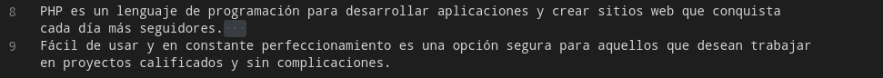

También se puede utilizar la etiqueta **< br >**
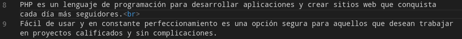 

## **Líneas Horizontales** 

Las líneas horizontales pueden ser útiles para separar contenido o secciones en un documento, esto se puede realizar agregando tres o más guiones bajos seguidos, estos deben estar solos en la línea  sin espacios ni caracteres a la izquierda o derecha.
```
_____
```

## **Formato en negrita**

Usar dos asteriscos ** o dos guiones bajos __ al principio y al final de la oración que quieres resaltar en negritas. 

## **Cursiva**

Para agregar texto en cursiva debes usar un solo asterisco * o un solo guion bajo _ tanto al inicio como al final de la oración que se quiere marcar como cursiva.

## **Agregar código en el párrafo**

Para agregar código en una línea se deben usar comillas triples invertidas antes y al final del bloque de código que quieres que tenga formato de código:   
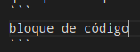    
```
# bloque de código
let num = 5;
num++;
```

## **Enlaces**

Para crear un enlace debes situar entre corchetes el texto que tendrá el enlace, después  entre paréntesis se coloca la URL al que nos redirigiremos, por ejemplo:   

Texto de complemento  [Texto que contendrá el enlace](https://enlace)   

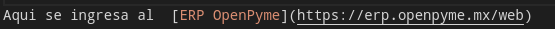  

## **Email**

También se pueden crear enlaces a direcciones de email, para ello se debe escribir entre los signos menor y mayor que, **< ejemplo@gmail.com >** ejemplo:

<ejemplo@gmail.com>

En la interfaz se observará el correo y al dar clic nos mandará a las opciones de cuentas en las que podemos acceder.

## **Tablas**

Para crear tablas se tiene que habilitar la compatibilidad con las tablas Markdown, esto se realiza en el archivo llamado **mkdocs.yml**, y se puede realizar de la siguiente manera:
```
markdown_extensions: 
	- tables
```

Después nos dirigimos al archivo de la página en donde necesitamos crear la tabla y la estructura seria:

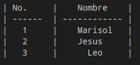  

Procedemos a realizar la tabla, por ejemplo:

| No.     |    Nombre    | 
| ------  | ------------ | 
|   1     |    Marisol   |
|   2     |    Jesus     |
|   3     |      Leo     |

Nota: Las líneas tanto horizontales como verticales son los bordes de la tabla que se mostrarán en la interfaz.

## **Agregar imágenes**

Agregar una imagen que tenemos guardada localmente.

1. Acceder al directorio en donde creamos el proyecto.
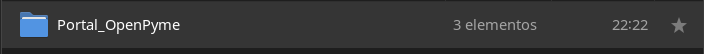  
2. Ingresar a la carpeta docs.
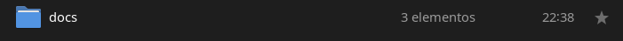  
3. Crear una carpeta exclusiva para guardar las imágenes.
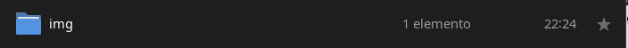  
4. Guardar o cambiar las imágenes que vamos a ocupar dentro de la carpeta que se ha creado.
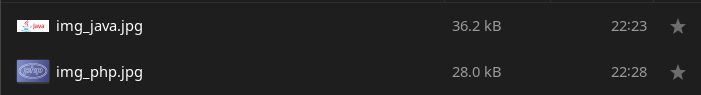  
5. Hay dos opciones para hacer que la imagen se muestre en la interfaz, una de ellas es:
```
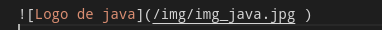  
```
  

otra es : 
```
<image src="/carpeta/nombre_imagen.jpg"  alt="Descripción de la imagen" width="50%" height="50%">
```
  
*Nota: En esta opción se puede agregar tanto el ancho como el alto de la imagen.*

Agregar imágenes es por medio de la Url, la cual nos permite acceder a las imágenes a través de internet.

1. Buscar en internet y seleccionar la imagen a ocupar.
2. Copiar solamente la Url.
3.  Utilizar la siguiente sintaxis, y en donde va la url se debe pegar el que habíamos copiado.
```

```
4.- Guardamos los cambios.

##  **Agregar botones**

Para agregar un botón se debe agregar una extensión de markdown, así que nos dirigimos al archivo **mkdocs.yml**, y en donde dice **markdown_extensions** escribimos lo siguiente:
```
markdown_extensions:
	- attr_list
```   
Después nos dirigimos al archivo en donde colocaremos el botón, por ejemplo, se agregará el botón y se redireccionará a la página de inicio.
```
[Button](#){ .md-button }
```
*Nota: Lo que se escribe en los [ ] es el nombre que se mostrará en el botón.*    
*Entre ( ) se coloca hacia donde nos mandará el botón.*     
*Y entre { } se coloca la clase del botón que necesitemos.*     

## **Agregar una lista**

Se pueden crear listas ordenadas que son las que llevan una numeración consecutiva, también se pueden realizar listas no ordenadas las cuales se representan con viñetas, por ejemplo:
### Listas ordenadas
1. Leo
2. Jesús
3. Marisol
```
### Listas ordenadas
1. Leo
2. Jesús
3. Marisol
```   

### Listas no ordenadas
- Alumnos
    * Leo
    * Jesús
    * Marisol
```
### Listas no ordenadas
- Alumnos
    * Leo
    * Jesús
    * Marisol
```

